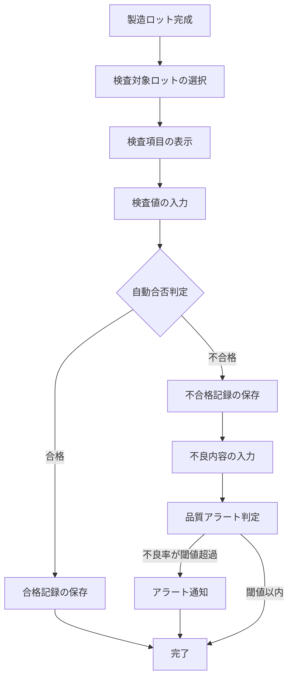
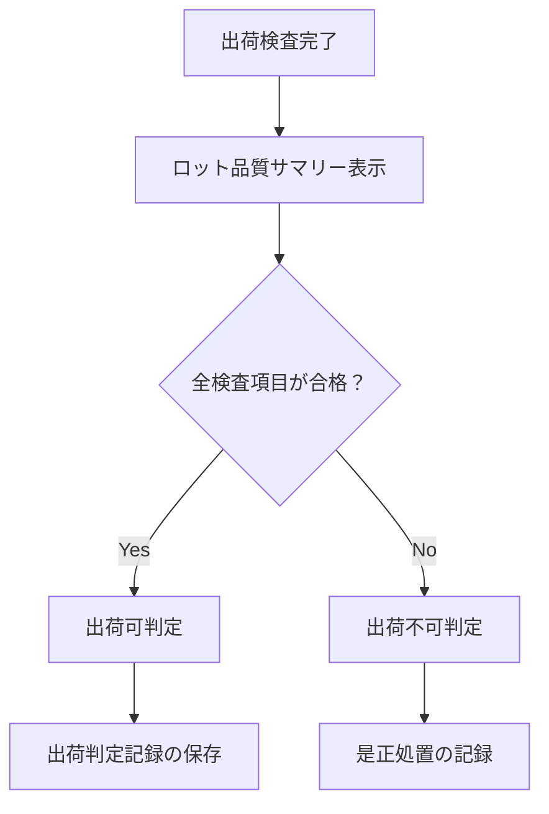
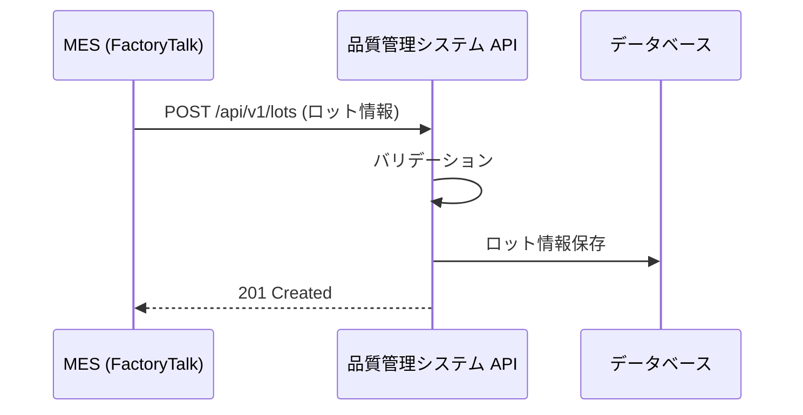

# 要件定義書: 製造ライン品質管理システム（AI 生成 → 人間レビュー済み）

> **本書の位置づけ**: AI が RFP と顧客回答から自動生成し、内製チームがレビュー・修正した要件定義書です。
> 基本設計以降の全工程は、本書の要件を基準に実施します。

---

## 1. システム概要

### 1.1 目的

製造ラインにおける品質検査データをデジタル化し、以下を実現する:

- 検査結果のリアルタイム記録・集計により、品質状況の即時把握を可能にする
- 不良率の傾向分析により、品質問題の予防的な改善を支援する
- ロット単位のトレーサビリティにより、顧客への品質データ提出を迅速化する

### 1.2 対象範囲

| 項目 | 内容 |
|------|------|
| 対象ライン | ブレーキパッド製造ライン、ディスクローター製造ライン、組立ライン |
| 対象工程 | 受入検査、工程内検査、最終検査、出荷検査 |
| データ量 | 約 1,000 件/日（3ライン合計） |

### 1.3 利用者

| ロール | 人数 | 主な操作 |
|--------|------|----------|
| 検査員 | 50名 | タブレットから検査結果を入力 |
| 品質管理者 | 10名 | ダッシュボード閲覧、品質レポート出力 |
| 品質保証担当 | 5名 | 出荷判定、顧客向けデータ出力 |
| システム管理者 | 2名 | マスタ管理、ユーザー管理 |

---

## 2. 業務フロー

### 2.1 検査業務フロー

### 2.2 出荷判定フロー

---

## 3. 機能要件

### F-01: 検査基準マスタ管理

| 項目 | 内容 |
|------|------|
| 概要 | 品目ごとの検査項目と合否判定基準を管理する |
| 入力 | 品目コード、検査項目名、検査種別（寸法/硬度/外観/表面粗さ）、下限値、上限値、単位 |
| 出力 | 検査基準マスタ一覧 |
| 処理ルール | 下限値 <= 上限値 であること。外観検査は「合格/不合格」の2値判定とする |

### F-02: 検査結果入力

| 項目 | 内容 |
|------|------|
| 概要 | タブレットから検査結果を入力し、合否を自動判定する |
| 入力 | ロット番号、品目コード、検査工程、各検査項目の測定値 |
| 出力 | 検査結果（各項目の合否判定結果を含む） |
| 処理ルール | 測定値が下限値以上かつ上限値以下であれば「合格」、それ以外は「不合格」。1項目でも不合格があれば、そのロットは「不合格」とする |

### F-03: 不良記録管理

| 項目 | 内容 |
|------|------|
| 概要 | 不合格となった検査結果に対して、不良内容の詳細を記録する |
| 入力 | 検査結果ID、不良区分（寸法不良/外観不良/材質不良/その他）、不良内容（テキスト）、処置（廃棄/手直し/特別採用） |
| 出力 | 不良記録 |
| 処理ルール | 不合格の検査結果に対してのみ不良記録を登録できる |

### F-04: 品質ダッシュボード

| 項目 | 内容 |
|------|------|
| 概要 | 品質状況をリアルタイムで可視化するダッシュボード |
| 表示項目 | ライン別不良率（当日/週次/月次）、不良区分別パレート図、検査件数推移、品質アラート一覧 |
| 更新頻度 | 5分間隔で自動更新 |
| フィルタ | 期間、ライン、品目、検査工程 |

### F-05: 品質アラート通知

| 項目 | 内容 |
|------|------|
| 概要 | 不良率が閾値を超えた場合にアラートを通知する |
| トリガー条件 | 直近1時間の不良率が設定閾値（デフォルト: 3%）を超えた場合 |
| 通知方法 | システム内通知 + メール通知 |
| 通知先 | 該当ラインの品質管理者 |

### F-06: ロットトレーサビリティ

| 項目 | 内容 |
|------|------|
| 概要 | ロット番号から全検査履歴を時系列で表示する |
| 入力 | ロット番号 |
| 出力 | 受入検査 → 工程内検査 → 最終検査 → 出荷検査の全記録（検査値、合否、検査員、検査日時） |
| 処理ルール | 変更履歴を含めて表示する（改ざん防止のため、削除は不可。修正は変更履歴として記録） |

### F-07: 品質レポート出力

| 項目 | 内容 |
|------|------|
| 概要 | 指定期間の品質レポートを CSV/Excel で出力する |
| 出力項目 | ロット番号、品目コード、検査日時、検査項目、測定値、判定結果、検査員ID |
| フィルタ | 期間、ライン、品目、合否 |

### F-08: MES 連携

| 項目 | 内容 |
|------|------|
| 概要 | MES（FactoryTalk）からロット情報・製造実績データを取得する |
| 連携方式 | REST API（MES → 本システム） |
| 連携データ | ロット番号、品目コード、製造日時、製造数量、ライン番号 |
| 連携タイミング | ロット完成時にリアルタイム連携（MES から Webhook） |
| エラー処理 | 連携失敗時はリトライ（最大3回、間隔: 30秒）。3回失敗時はアラート通知 |

---

## 4. 非機能要件

| カテゴリ | 要件ID | 要件 | 目標値 |
|---------|--------|------|--------|
| 性能 | NF-01 | 画面の初期表示時間 | 2秒以内 |
| 性能 | NF-02 | 検査結果の保存（1件） | 1秒以内 |
| 性能 | NF-03 | ダッシュボードの描画 | 3秒以内 |
| 性能 | NF-04 | 同時接続ユーザー数 | 70名 |
| 可用性 | NF-05 | システム稼働時間 | 平日 6:00〜22:00 |
| 可用性 | NF-06 | 目標稼働率 | 99.5%以上 |
| セキュリティ | NF-07 | 認証方式 | Active Directory 連携（SSO） |
| セキュリティ | NF-08 | 操作ログ | 全操作を記録し10年間保持 |
| セキュリティ | NF-09 | データ改ざん防止 | 記録の変更は履歴として保持。物理削除は不可 |
| データ | NF-10 | データ保持期間 | 10年間 |

---

## 5. 外部連携要件

### 5.1 MES 連携

---

## 6. 用語定義

| 日本語 | 英語（システム内統一名称） | 説明 |
|--------|-------------------------|------|
| 検査基準 | `inspection_standard` | 品目ごとの検査項目と合否判定基準 |
| 検査結果 | `inspection_result` | 1ロット1検査工程の検査記録 |
| 検査明細 | `inspection_detail` | 検査項目ごとの測定値と合否 |
| 不良記録 | `defect_record` | 不合格時の不良内容と処置 |
| ロット | `lot` | 製造単位。MES から連携 |
| 品目 | `item` | 製造する製品の種別 |
| 検査工程 | `inspection_phase` | 受入/工程内/最終/出荷 の4種別 |
| 品質アラート | `quality_alert` | 不良率閾値超過時の通知 |
| 出荷判定 | `shipment_decision` | ロットの出荷可否判定 |
