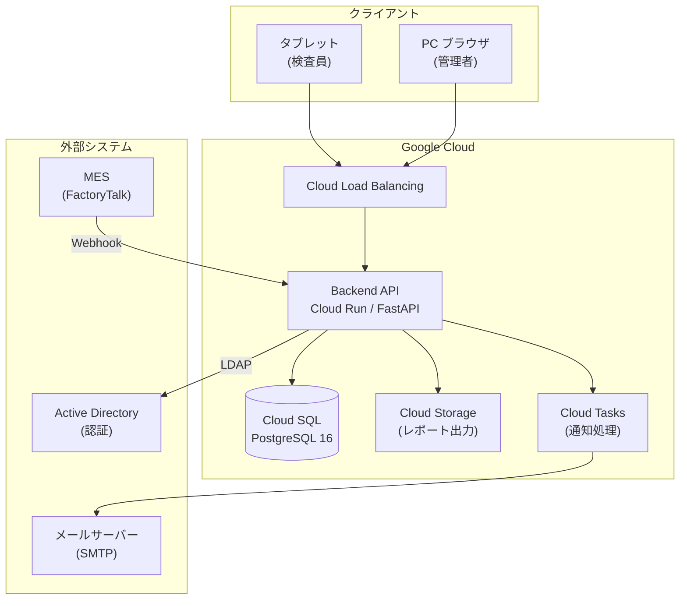
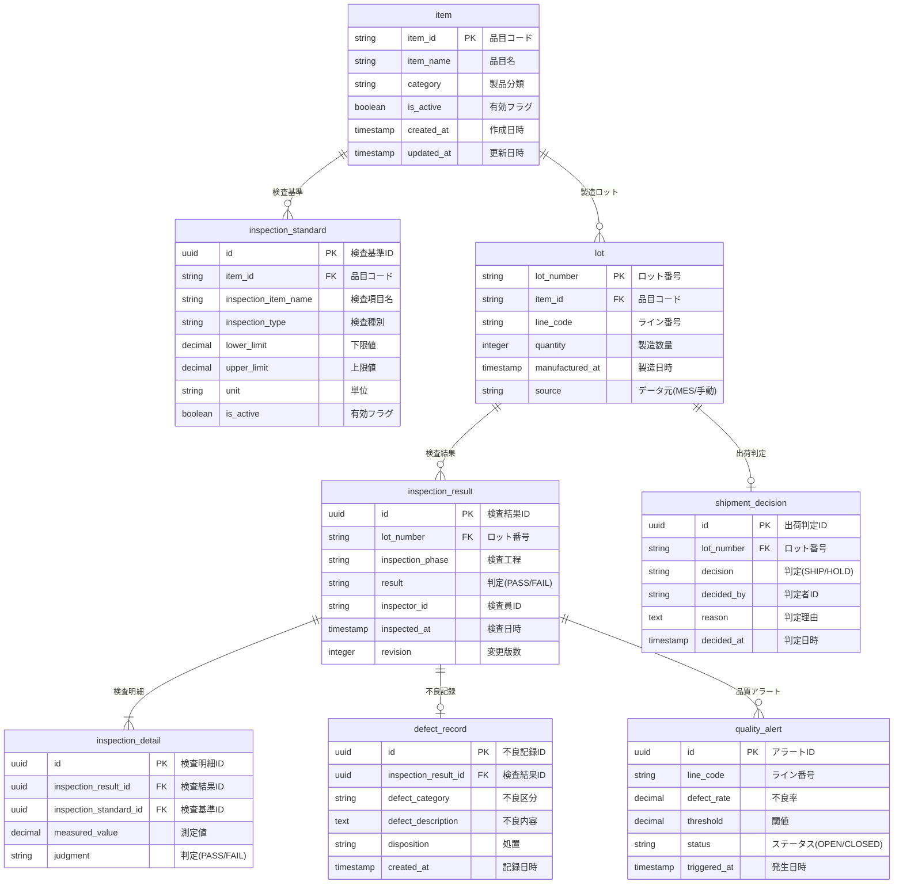

# 基本設計書: 製造ライン品質管理システム（AI 生成 → 人間レビュー済み）

---

## 1. システムアーキテクチャ

### 1.1 コンポーネント構成図



### 1.2 技術スタック

| レイヤー | 技術 | バージョン | 選定理由 |
|---------|------|-----------|---------|
| バックエンド | Python + FastAPI | 3.14 / 0.115+ | 高性能な非同期API、型安全 |
| ORM | SQLAlchemy | 2.0+ | Python標準のORM |
| バリデーション | Pydantic | 2.10+ | FastAPIとの統合、厳密な型チェック |
| データベース | PostgreSQL | 16 | JSON対応、堅牢性 |
| フロントエンド | Flutter Web | 3.x | タブレット・PC両対応のレスポンシブ |
| 認証 | Active Directory (LDAP) | - | 既存の社内認証基盤を活用 |
| CI/CD | Cloud Build | - | Google Cloud ネイティブ |
| 監視 | Cloud Monitoring | - | 稼働率・応答時間の監視 |

---

## 2. データベース設計

### 2.1 ER 図



### 2.2 テーブル定義（主要テーブル）

#### inspection_result（検査結果）

| カラム名 | 型 | 制約 | 説明 |
|---------|-----|------|------|
| id | UUID | PK, NOT NULL | 検査結果ID（自動採番） |
| lot_number | VARCHAR(20) | FK, NOT NULL | ロット番号 |
| inspection_phase | VARCHAR(20) | NOT NULL | 検査工程（INCOMING/IN_PROCESS/FINAL/SHIPPING） |
| result | VARCHAR(10) | NOT NULL | 判定結果（PASS/FAIL） |
| inspector_id | VARCHAR(50) | NOT NULL | 検査員ID |
| inspected_at | TIMESTAMP | NOT NULL | 検査日時 |
| revision | INTEGER | NOT NULL, DEFAULT 1 | 変更版数（改ざん防止用） |
| created_at | TIMESTAMP | NOT NULL | 作成日時 |

### 2.3 インデックス設計

| テーブル | インデックス | カラム | 理由 |
|---------|-------------|--------|------|
| inspection_result | idx_ir_lot | lot_number | ロット単位の検査履歴取得の高速化 |
| inspection_result | idx_ir_phase_date | inspection_phase, inspected_at | 工程別・期間別の集計の高速化 |
| inspection_detail | idx_id_result | inspection_result_id | 検査結果に紐づく明細取得の高速化 |
| quality_alert | idx_qa_status | status, triggered_at | 未対応アラートの一覧取得の高速化 |
| lot | idx_lot_item_date | item_id, manufactured_at | 品目別・期間別のロット検索の高速化 |

---

## 3. API 設計

### 3.1 エンドポイント一覧

| メソッド | パス | 機能 | 対応要件 |
|---------|------|------|---------|
| GET | `/api/v1/items` | 品目一覧取得 | F-01 |
| GET | `/api/v1/items/{item_id}/standards` | 検査基準一覧取得 | F-01 |
| POST | `/api/v1/items/{item_id}/standards` | 検査基準登録 | F-01 |
| POST | `/api/v1/lots` | ロット登録（MES連携） | F-08 |
| GET | `/api/v1/lots/{lot_number}` | ロット詳細取得 | F-06 |
| POST | `/api/v1/inspections` | 検査結果登録 | F-02 |
| GET | `/api/v1/inspections` | 検査結果一覧取得 | F-02 |
| POST | `/api/v1/defects` | 不良記録登録 | F-03 |
| GET | `/api/v1/dashboard/defect-rate` | 不良率集計取得 | F-04 |
| GET | `/api/v1/dashboard/alerts` | アラート一覧取得 | F-05 |
| POST | `/api/v1/lots/{lot_number}/shipment-decision` | 出荷判定登録 | F-06 |
| GET | `/api/v1/lots/{lot_number}/traceability` | トレーサビリティ取得 | F-06 |
| GET | `/api/v1/reports/export` | レポート CSV 出力 | F-07 |

### 3.2 主要 API 定義

#### POST /api/v1/inspections（検査結果登録）

**リクエスト:**
```json
{
  "lot_number": "20260401-BP-001",
  "inspection_phase": "IN_PROCESS",
  "inspector_id": "INS-001",
  "details": [
    {
      "inspection_standard_id": "uuid-xxx",
      "measured_value": 12.35
    },
    {
      "inspection_standard_id": "uuid-yyy",
      "measured_value": 8.20
    }
  ]
}
```

**レスポンス (201 Created):**
```json
{
  "id": "uuid-result-001",
  "lot_number": "20260401-BP-001",
  "inspection_phase": "IN_PROCESS",
  "result": "PASS",
  "inspector_id": "INS-001",
  "inspected_at": "2026-04-01T10:30:00Z",
  "details": [
    {
      "inspection_item_name": "外径寸法",
      "measured_value": 12.35,
      "lower_limit": 12.00,
      "upper_limit": 12.50,
      "judgment": "PASS"
    },
    {
      "inspection_item_name": "内径寸法",
      "measured_value": 8.20,
      "lower_limit": 8.00,
      "upper_limit": 8.40,
      "judgment": "PASS"
    }
  ]
}
```

**エラーレスポンス (422):**
```json
{
  "error_code": "VALIDATION_ERROR",
  "detail": "ロット番号 20260401-BP-999 は存在しません",
  "params": {"lot_number": "20260401-BP-999"}
}
```

---

## 4. 画面一覧

| 画面ID | 画面名 | 概要 | 主な使用API | 利用者 |
|--------|--------|------|-----------|--------|
| S-01 | ログイン | AD認証によるログイン | - | 全員 |
| S-02 | 検査入力 | ロット選択→検査値入力→合否確認 | POST /inspections | 検査員 |
| S-03 | 検査履歴 | 検査結果の一覧表示・検索 | GET /inspections | 品質管理者 |
| S-04 | ダッシュボード | 不良率グラフ、アラート一覧 | GET /dashboard/* | 品質管理者 |
| S-05 | トレーサビリティ | ロット単位の検査履歴表示 | GET /traceability | 品質保証担当 |
| S-06 | 出荷判定 | ロットの出荷可否を判定 | POST /shipment-decision | 品質保証担当 |
| S-07 | レポート出力 | CSV/Excelエクスポート | GET /reports/export | 品質管理者 |
| S-08 | マスタ管理 | 品目・検査基準の管理 | GET/POST /items, /standards | 管理者 |
