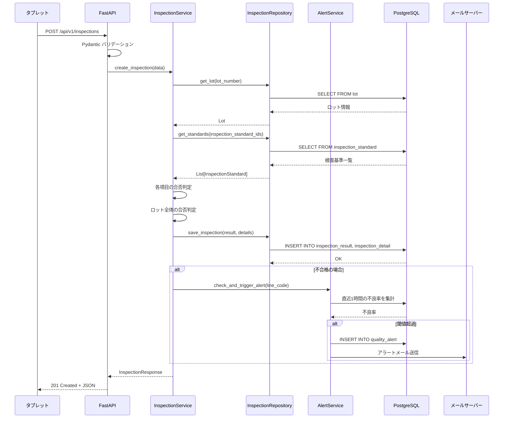
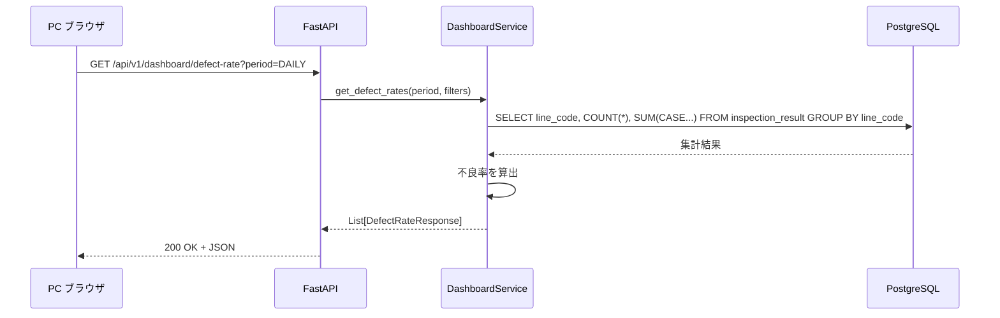

# 詳細設計書: 製造ライン品質管理システム（AI 生成 → 人間レビュー済み）

---

## 1. ディレクトリ構成

```
app/
├── main.py                      # FastAPI アプリケーションのエントリーポイント
├── core/
│   ├── config.py                # 環境変数・設定管理
│   └── exceptions.py            # カスタム例外クラス
├── models/
│   ├── item.py                  # 品目テーブル
│   ├── inspection_standard.py   # 検査基準テーブル
│   ├── lot.py                   # ロットテーブル
│   ├── inspection_result.py     # 検査結果テーブル
│   ├── inspection_detail.py     # 検査明細テーブル
│   ├── defect_record.py         # 不良記録テーブル
│   ├── quality_alert.py         # 品質アラートテーブル
│   └── shipment_decision.py     # 出荷判定テーブル
├── schemas/
│   ├── inspection.py            # 検査関連のリクエスト/レスポンス
│   ├── lot.py                   # ロット関連のリクエスト/レスポンス
│   ├── defect.py                # 不良記録関連
│   ├── dashboard.py             # ダッシュボード関連
│   └── common.py                # 共通レスポンス（エラー、ページネーション）
├── services/
│   ├── inspection_service.py    # 検査業務ロジック
│   ├── defect_service.py        # 不良記録業務ロジック
│   ├── dashboard_service.py     # ダッシュボード集計ロジック
│   ├── alert_service.py         # 品質アラートロジック
│   └── lot_service.py           # ロット管理ロジック
├── repositories/
│   ├── inspection_repository.py # 検査データのDB操作
│   ├── lot_repository.py        # ロットデータのDB操作
│   └── alert_repository.py      # アラートデータのDB操作
├── api/
│   └── v1/
│       ├── inspections.py       # 検査関連エンドポイント
│       ├── lots.py              # ロット関連エンドポイント
│       ├── defects.py           # 不良記録エンドポイント
│       ├── dashboard.py         # ダッシュボードエンドポイント
│       └── reports.py           # レポートエンドポイント
├── db/
│   ├── session.py               # DB セッション管理
│   └── migrations/              # Alembic マイグレーション
└── tests/
    ├── unit/                    # 単体テスト
    └── integration/             # 結合テスト
```

---

## 2. Pydantic スキーマ定義

### 2.1 検査関連スキーマ

```python
"""検査関連の Pydantic スキーマ定義。"""

from datetime import datetime
from decimal import Decimal
from uuid import UUID

from pydantic import BaseModel, Field


class InspectionDetailCreate(BaseModel):
    """検査明細の入力スキーマ。"""

    inspection_standard_id: UUID = Field(
        ..., description="検査基準ID"
    )
    measured_value: Decimal = Field(
        ..., description="測定値", decimal_places=2
    )


class InspectionCreate(BaseModel):
    """検査結果登録のリクエストスキーマ。"""

    lot_number: str = Field(
        ...,
        pattern=r"^\d{8}-[A-Z]+-\d{3}$",
        description="ロット番号（例: 20260401-BP-001）",
    )
    inspection_phase: str = Field(
        ...,
        pattern=r"^(INCOMING|IN_PROCESS|FINAL|SHIPPING)$",
        description="検査工程",
    )
    inspector_id: str = Field(
        ..., min_length=1, max_length=50, description="検査員ID"
    )
    details: list[InspectionDetailCreate] = Field(
        ..., min_length=1, description="検査明細（1件以上必須）"
    )


class InspectionDetailResponse(BaseModel):
    """検査明細のレスポンススキーマ。"""

    inspection_item_name: str
    measured_value: Decimal
    lower_limit: Decimal
    upper_limit: Decimal
    unit: str
    judgment: str  # "PASS" or "FAIL"


class InspectionResponse(BaseModel):
    """検査結果登録のレスポンススキーマ。"""

    id: UUID
    lot_number: str
    inspection_phase: str
    result: str  # "PASS" or "FAIL"
    inspector_id: str
    inspected_at: datetime
    details: list[InspectionDetailResponse]
```

### 2.2 ロット関連スキーマ

```python
"""ロット関連の Pydantic スキーマ定義。"""

from datetime import datetime

from pydantic import BaseModel, Field


class LotCreate(BaseModel):
    """ロット登録のリクエストスキーマ（MES連携）。"""

    lot_number: str = Field(
        ...,
        pattern=r"^\d{8}-[A-Z]+-\d{3}$",
        description="ロット番号",
    )
    item_id: str = Field(..., description="品目コード")
    line_code: str = Field(..., description="ライン番号")
    quantity: int = Field(..., gt=0, description="製造数量")
    manufactured_at: datetime = Field(..., description="製造日時")


class LotResponse(BaseModel):
    """ロットのレスポンススキーマ。"""

    lot_number: str
    item_id: str
    line_code: str
    quantity: int
    manufactured_at: datetime
    source: str  # "MES" or "MANUAL"
```

### 2.3 ダッシュボード関連スキーマ

```python
"""ダッシュボード関連の Pydantic スキーマ定義。"""

from datetime import datetime
from decimal import Decimal

from pydantic import BaseModel


class DefectRateResponse(BaseModel):
    """不良率集計のレスポンススキーマ。"""

    line_code: str
    period: str  # "DAILY", "WEEKLY", "MONTHLY"
    total_inspections: int
    failed_inspections: int
    defect_rate: Decimal  # パーセンテージ（例: 2.5）


class QualityAlertResponse(BaseModel):
    """品質アラートのレスポンススキーマ。"""

    id: str
    line_code: str
    defect_rate: Decimal
    threshold: Decimal
    status: str  # "OPEN" or "CLOSED"
    triggered_at: datetime
```

---

## 3. サービスクラス設計

### 3.1 InspectionService（検査業務ロジック）

```python
class InspectionService:
    """検査業務のビジネスロジックを担当するサービスクラス。"""

    def create_inspection(self, data: InspectionCreate) -> InspectionResponse:
        """検査結果を登録し、合否を自動判定する。

        処理フロー:
        1. ロット番号の存在チェック
        2. 検査基準の取得（inspection_standard_id → 上限値/下限値）
        3. 各検査項目の合否判定
           - lower_limit <= measured_value <= upper_limit → PASS
           - それ以外 → FAIL
        4. 全項目の判定結果から、ロット全体の合否を決定
           - 1項目でも FAIL があれば全体も FAIL
        5. 検査結果と明細を DB に保存
        6. FAIL の場合、不良率チェック → アラート判定を実行
        7. レスポンスを返却
        """
        ...

    def get_inspections(
        self,
        lot_number: str | None,
        inspection_phase: str | None,
        limit: int,
        offset: int,
    ) -> list[InspectionResponse]:
        """検査結果を条件指定で取得する。"""
        ...
```

### 3.2 AlertService（品質アラートロジック）

```python
class AlertService:
    """品質アラートのビジネスロジックを担当するサービスクラス。"""

    def check_and_trigger_alert(self, line_code: str) -> None:
        """直近1時間の不良率をチェックし、閾値超過時にアラートを発行する。

        処理フロー:
        1. 直近1時間の検査結果を取得（該当ラインのみ）
        2. 不良率を算出: 不合格件数 / 全検査件数 * 100
        3. 不良率 > 閾値（デフォルト: 3%）の場合:
           a. quality_alert テーブルに記録
           b. 該当ラインの品質管理者にメール通知
        """
        ...
```

---

## 4. 処理シーケンス

### 4.1 検査結果登録のシーケンス



### 4.2 ダッシュボード表示のシーケンス



---

## 5. エラーハンドリング設計

### 5.1 エラーコード一覧

| エラーコード | HTTPステータス | 説明 | 発生条件 |
|-------------|---------------|------|---------|
| `LOT_NOT_FOUND` | 404 | ロットが存在しない | 指定されたロット番号がDBに存在しない |
| `STANDARD_NOT_FOUND` | 404 | 検査基準が存在しない | 指定された検査基準IDがDBに存在しない |
| `VALIDATION_ERROR` | 422 | 入力値が不正 | Pydantic バリデーションエラー |
| `DUPLICATE_INSPECTION` | 409 | 検査結果が重複 | 同一ロット・同一工程の検査が既に存在 |
| `MES_CONNECTION_ERROR` | 502 | MES連携エラー | MESへの接続がタイムアウト |
| `INTERNAL_ERROR` | 500 | 内部エラー | 予期しないサーバーエラー |

### 5.2 例外クラス階層

```python
class AppException(Exception):
    """アプリケーション共通の基底例外。"""

    def __init__(self, error_code: str, detail: str, status_code: int = 400):
        self.error_code = error_code
        self.detail = detail
        self.status_code = status_code


class NotFoundException(AppException):
    """リソースが見つからない場合の例外。"""

    def __init__(self, resource: str, identifier: str):
        super().__init__(
            error_code=f"{resource.upper()}_NOT_FOUND",
            detail=f"{resource} '{identifier}' は存在しません",
            status_code=404,
        )


class DuplicateException(AppException):
    """リソースが重複する場合の例外。"""

    def __init__(self, detail: str):
        super().__init__(
            error_code="DUPLICATE_INSPECTION",
            detail=detail,
            status_code=409,
        )
```
