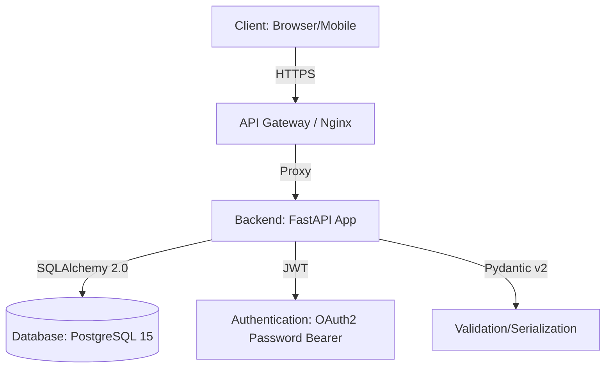
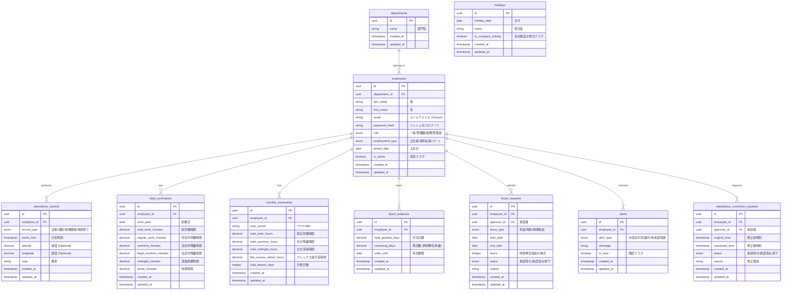
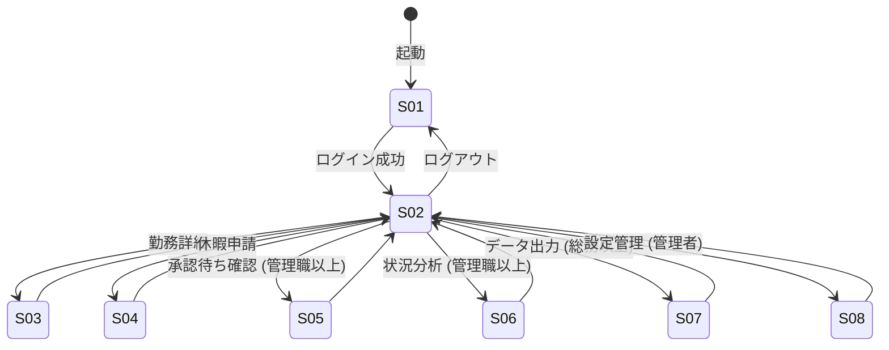

# 基本設計書：従業員勤怠管理システム

## 1. システム構成図



### インフラ構成要素
- **API Gateway**: リクエストのルーティング、SSL終端、レート制限を担当。
- **FastAPI**: 非同期処理をベースとした高パフォーマンスな REST API。
- **PostgreSQL**: 勤怠データ、マスタデータの永続化。
- **JWT**: ステートレスな認証を実現。

---

## 2. ER図（Mermaid 記法）



---

## 3. API エンドポイント一覧

ベースURL: `/api/v1`

| # | メソッド | パス | 説明 | 認可 (Role) |
|---|---|---|---|---|
| 1 | POST | `/auth/login` | ログイン（JWT発行） | 全員 |
| 2 | POST | `/attendance/clock-in` | 出勤打刻（位置情報含む） | 全員 |
| 3 | POST | `/attendance/clock-out` | 退勤打刻（位置情報含む） | 全員 |
| 4 | GET | `/attendance/records` | 打刻履歴一覧取得（自分） | 全員 |
| 5 | POST | `/attendance/corrections` | 打刻修正申請 | 全員 |
| 6 | GET | `/attendance/summaries/daily` | 日次勤務詳細取得 | 全員 |
| 7 | GET | `/attendance/summaries/monthly` | 月次サマリー取得 | 全員 |
| 8 | POST | `/leaves/requests` | 休暇申請（全日/半日/時間） | 全員 |
| 9 | GET | `/leaves/balances` | 有給残数・取得状況確認 | 全員 |
| 10 | GET | `/approvals/pending` | 承認待ち一覧取得 | 管理職/総務 |
| 11 | PATCH | `/approvals/{request_id}` | 申請の承認・却下 | 管理職/総務 |
| 12 | GET | `/analytics/overtime` | 部署・個人の残業推移グラフデータ | 管理職/総務 |
| 13 | GET | `/exports/payroll` | 給与大臣連携CSV出力 | 総務 |
| 14 | GET | `/admin/employees` | 従業員一覧取得 | 管理者 |
| 15 | POST | `/admin/employees` | 従業員登録 | 管理者 |
| 16 | PUT | `/admin/employees/{id}` | 従業員情報更新 | 管理者 |
| 17 | GET | `/admin/departments` | 部門一覧取得 | 管理者 |
| 18 | GET | `/admin/holidays` | 会社カレンダー・祝日取得 | 全員 |
| 19 | POST | `/admin/holidays` | 祝日設定 | 管理者 |
| 20 | GET | `/alerts` | アラート通知一覧 | 全員 |

### エラーレスポンス (RFC 7807 準拠)
```json
{
  "type": "https://example.com/probs/validation-error",
  "title": "Bad Request",
  "status": 400,
  "detail": "clock_in time cannot be in the future.",
  "instance": "/attendance/clock-in"
}
```

---

## 4. 画面一覧と画面遷移図

### 画面一覧
| 画面ID | 画面名 | 説明 |
|---|---|---|
| S-01 | ログイン画面 | 認証情報の入力。 |
| S-02 | ダッシュボード | 打刻ボタン、勤怠サマリー、通知表示。 |
| S-03 | 勤務表（個人） | 日別勤務データの表示と修正申請。 |
| S-04 | 休暇申請画面 | 各種休暇の申請入力。 |
| S-05 | 承認管理画面 | 部下の申請承認・却下。 |
| S-06 | 分析ダッシュボード | 残業推移や取得義務のグラフ表示。 |
| S-07 | データ出力画面 | CSV出力。 |
| S-08 | マスタ管理画面 | 従業員、部門、カレンダーの設定。 |

### 画面遷移図 (Mermaid)



---

## 5. 認証・認可設計

### ロールベースアクセス制御 (RBAC)

| ロール | 権限範囲 |
|---|---|
| **一般 (General)** | 自身の打刻、自身の勤怠・休暇申請、自身のサマリー閲覧。 |
| **管理職 (Manager)** | 一般の権限 ＋ 部門配下の従業員の申請承認、部門勤務状況の閲覧・分析。 |
| **総務 (HR)** | 全従業員の勤怠データ閲覧、給与連携CSVの出力、有給付与・管理。 |
| **管理者 (Admin)** | 全ての権限 ＋ マスタ管理（従業員・部門・祝日）、システム設定。 |

---

## 6. 勤怠計算ロジック（補足）

### 休憩時間の自動控除
実労働時間 $T$ に基づき算出：
- $6 < T \le 8$：45分控除
- $T > 8$：60分控除

### 36協定監視
- `daily_summaries` 更新時に、当月の `overtime_minutes` 合計をチェック。
- 36時間を超過した場合、`alerts` テーブルにレコードを挿入し、非同期でプッシュ通知。
