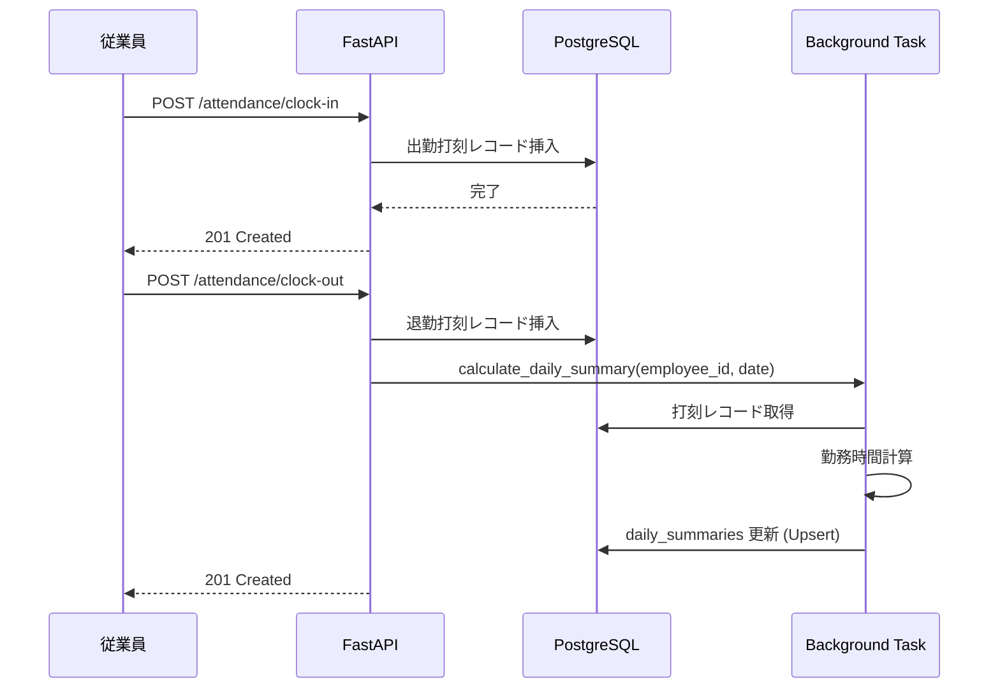
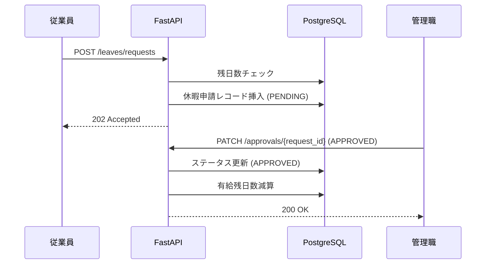
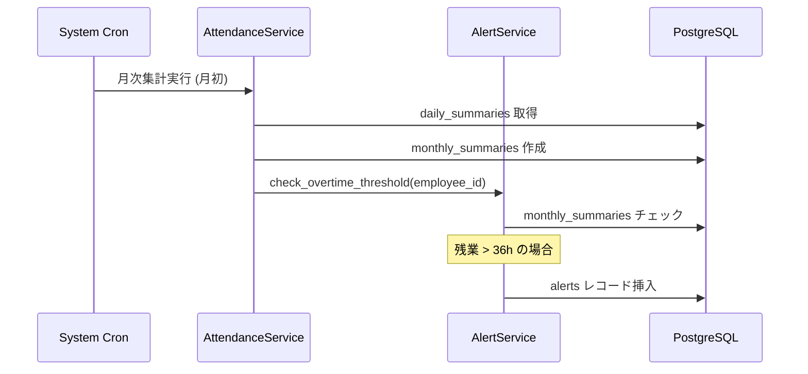

# 詳細設計書：従業員勤怠管理システム

## 1. SQLAlchemy モデルクラス設計 (SQLAlchemy 2.0)

SQLAlchemy 2.0 の `Mapped` と `mapped_column` を使用し、型安全なモデルを定義する。

```python
from datetime import date, datetime
from decimal import Decimal
from enum import Enum
from typing import List, Optional
from uuid import UUID, uuid4

from sqlalchemy import ForeignKey, String, Text, Numeric, Boolean, Enum as SAEnum, Date, DateTime
from sqlalchemy.orm import DeclarativeBase, Mapped, mapped_column, relationship

class Base(DeclarativeBase):
    pass

class RoleEnum(str, Enum):
    GENERAL = "一般"
    MANAGER = "管理職"
    HR = "総務"
    ADMIN = "管理者"

class EmploymentTypeEnum(str, Enum):
    REGULAR = "正社員"
    CONTRACT = "契約社員"
    PART_TIME = "パート"

class RecordTypeEnum(str, Enum):
    CLOCK_IN = "出勤"
    CLOCK_OUT = "退勤"
    BREAK_START = "休憩開始"
    BREAK_END = "休憩終了"

class LeaveTypeEnum(str, Enum):
    PAID = "有給"
    SPECIAL = "特別"
    HOURLY_PAID = "時間有給"

class RequestStatusEnum(str, Enum):
    PENDING = "承認待ち"
    APPROVED = "承認済み"
    REJECTED = "却下"

class AlertTypeEnum(str, Enum):
    OVERTIME_36 = "36協定"
    MISSING_CLOCK = "打刻漏れ"
    UNAPPROVED_REQUEST = "未承認申請"

class Department(Base):
    __tablename__ = "departments"
    id: Mapped[UUID] = mapped_column(primary_key=True, default=uuid4)
    name: Mapped[str] = mapped_column(String(100))
    created_at: Mapped[datetime] = mapped_column(DateTime, default=datetime.now)
    updated_at: Mapped[datetime] = mapped_column(DateTime, default=datetime.now, onupdate=datetime.now)

    employees: Mapped[List["Employee"]] = relationship(back_populates="department")

class Employee(Base):
    __tablename__ = "employees"
    id: Mapped[UUID] = mapped_column(primary_key=True, default=uuid4)
    department_id: Mapped[UUID] = mapped_column(ForeignKey("departments.id"))
    last_name: Mapped[str] = mapped_column(String(50))
    first_name: Mapped[str] = mapped_column(String(50))
    email: Mapped[str] = mapped_column(String(255), unique=True, index=True)
    password_hash: Mapped[str] = mapped_column(String(255))
    role: Mapped[RoleEnum] = mapped_column(SAEnum(RoleEnum))
    employment_type: Mapped[EmploymentTypeEnum] = mapped_column(SAEnum(EmploymentTypeEnum))
    joined_date: Mapped[date] = mapped_column(Date)
    is_active: Mapped[bool] = mapped_column(Boolean, default=True)
    created_at: Mapped[datetime] = mapped_column(DateTime, default=datetime.now)
    updated_at: Mapped[datetime] = mapped_column(DateTime, default=datetime.now, onupdate=datetime.now)

    department: Mapped["Department"] = relationship(back_populates="employees")
    attendance_records: Mapped[List["AttendanceRecord"]] = relationship(back_populates="employee")
    daily_summaries: Mapped[List["DailySummary"]] = relationship(back_populates="employee")
    monthly_summaries: Mapped[List["MonthlySummary"]] = relationship(back_populates="employee")
    correction_requests: Mapped[List["AttendanceCorrectionRequest"]] = relationship(back_populates="employee")

class AttendanceRecord(Base):
    __tablename__ = "attendance_records"
    id: Mapped[UUID] = mapped_column(primary_key=True, default=uuid4)
    employee_id: Mapped[UUID] = mapped_column(ForeignKey("employees.id"))
    record_type: Mapped[RecordTypeEnum] = mapped_column(SAEnum(RecordTypeEnum))
    event_time: Mapped[datetime] = mapped_column(DateTime)
    latitude: Mapped[Optional[Decimal]] = mapped_column(Numeric(10, 7))
    longitude: Mapped[Optional[Decimal]] = mapped_column(Numeric(10, 7))
    note: Mapped[Optional[str]] = mapped_column(Text)
    created_at: Mapped[datetime] = mapped_column(DateTime, default=datetime.now)
    updated_at: Mapped[datetime] = mapped_column(DateTime, default=datetime.now, onupdate=datetime.now)

    employee: Mapped["Employee"] = relationship(back_populates="attendance_records")

class AttendanceCorrectionRequest(Base):
    __tablename__ = "attendance_correction_requests"
    id: Mapped[UUID] = mapped_column(primary_key=True, default=uuid4)
    employee_id: Mapped[UUID] = mapped_column(ForeignKey("employees.id"))
    approver_id: Mapped[Optional[UUID]] = mapped_column(ForeignKey("employees.id"))
    original_time: Mapped[datetime] = mapped_column(DateTime)
    requested_time: Mapped[datetime] = mapped_column(DateTime)
    status: Mapped[RequestStatusEnum] = mapped_column(SAEnum(RequestStatusEnum), default=RequestStatusEnum.PENDING)
    reason: Mapped[str] = mapped_column(Text)
    created_at: Mapped[datetime] = mapped_column(DateTime, default=datetime.now)
    updated_at: Mapped[datetime] = mapped_column(DateTime, default=datetime.now, onupdate=datetime.now)

    employee: Mapped["Employee"] = relationship(back_populates="correction_requests")

class DailySummary(Base):
    __tablename__ = "daily_summaries"
    id: Mapped[UUID] = mapped_column(primary_key=True, default=uuid4)
    employee_id: Mapped[UUID] = mapped_column(ForeignKey("employees.id"))
    work_date: Mapped[date] = mapped_column(Date)
    total_work_minutes: Mapped[Decimal] = mapped_column(Numeric(10, 2))
    regular_work_minutes: Mapped[Decimal] = mapped_column(Numeric(10, 2))
    overtime_minutes: Mapped[Decimal] = mapped_column(Numeric(10, 2))
    legal_overtime_minutes: Mapped[Decimal] = mapped_column(Numeric(10, 2))
    midnight_minutes: Mapped[Decimal] = mapped_column(Numeric(10, 2))
    break_minutes: Mapped[Decimal] = mapped_column(Numeric(10, 2))
    created_at: Mapped[datetime] = mapped_column(DateTime, default=datetime.now)
    updated_at: Mapped[datetime] = mapped_column(DateTime, default=datetime.now, onupdate=datetime.now)

    employee: Mapped["Employee"] = relationship(back_populates="daily_summaries")

class MonthlySummary(Base):
    __tablename__ = "monthly_summaries"
    id: Mapped[UUID] = mapped_column(primary_key=True, default=uuid4)
    employee_id: Mapped[UUID] = mapped_column(ForeignKey("employees.id"))
    year_month: Mapped[str] = mapped_column(String(7))  # YYYY-MM
    total_work_hours: Mapped[Decimal] = mapped_column(Numeric(10, 2))
    total_overtime_hours: Mapped[Decimal] = mapped_column(Numeric(10, 2))
    total_midnight_hours: Mapped[Decimal] = mapped_column(Numeric(10, 2))
    flex_excess_deficit_hours: Mapped[Decimal] = mapped_column(Numeric(10, 2))
    total_absent_days: Mapped[int] = mapped_column()
    created_at: Mapped[datetime] = mapped_column(DateTime, default=datetime.now)
    updated_at: Mapped[datetime] = mapped_column(DateTime, default=datetime.now, onupdate=datetime.now)

    employee: Mapped["Employee"] = relationship(back_populates="monthly_summaries")

class LeaveBalance(Base):
    __tablename__ = "leave_balances"
    id: Mapped[UUID] = mapped_column(primary_key=True, default=uuid4)
    employee_id: Mapped[UUID] = mapped_column(ForeignKey("employees.id"))
    total_granted_days: Mapped[Decimal] = mapped_column(Numeric(5, 2))
    remaining_days: Mapped[Decimal] = mapped_column(Numeric(5, 2))
    valid_until: Mapped[date] = mapped_column(Date)
    created_at: Mapped[datetime] = mapped_column(DateTime, default=datetime.now)
    updated_at: Mapped[datetime] = mapped_column(DateTime, default=datetime.now, onupdate=datetime.now)

class LeaveRequest(Base):
    __tablename__ = "leave_requests"
    id: Mapped[UUID] = mapped_column(primary_key=True, default=uuid4)
    employee_id: Mapped[UUID] = mapped_column(ForeignKey("employees.id"))
    approver_id: Mapped[Optional[UUID]] = mapped_column(ForeignKey("employees.id"))
    leave_type: Mapped[LeaveTypeEnum] = mapped_column(SAEnum(LeaveTypeEnum))
    start_date: Mapped[date] = mapped_column(Date)
    end_date: Mapped[date] = mapped_column(Date)
    hours: Mapped[Optional[int]] = mapped_column()
    status: Mapped[RequestStatusEnum] = mapped_column(SAEnum(RequestStatusEnum), default=RequestStatusEnum.PENDING)
    reason: Mapped[Optional[str]] = mapped_column(Text)
    created_at: Mapped[datetime] = mapped_column(DateTime, default=datetime.now)
    updated_at: Mapped[datetime] = mapped_column(DateTime, default=datetime.now, onupdate=datetime.now)

class Holiday(Base):
    __tablename__ = "holidays"
    id: Mapped[UUID] = mapped_column(primary_key=True, default=uuid4)
    holiday_date: Mapped[date] = mapped_column(Date, unique=True)
    name: Mapped[str] = mapped_column(String(100))
    is_company_holiday: Mapped[bool] = mapped_column(Boolean, default=False)
    created_at: Mapped[datetime] = mapped_column(DateTime, default=datetime.now)
    updated_at: Mapped[datetime] = mapped_column(DateTime, default=datetime.now, onupdate=datetime.now)

class Alert(Base):
    __tablename__ = "alerts"
    id: Mapped[UUID] = mapped_column(primary_key=True, default=uuid4)
    employee_id: Mapped[UUID] = mapped_column(ForeignKey("employees.id"))
    alert_type: Mapped[AlertTypeEnum] = mapped_column(SAEnum(AlertTypeEnum))
    message: Mapped[str] = mapped_column(Text)
    is_read: Mapped[bool] = mapped_column(Boolean, default=False)
    created_at: Mapped[datetime] = mapped_column(DateTime, default=datetime.now)
    updated_at: Mapped[datetime] = mapped_column(DateTime, default=datetime.now, onupdate=datetime.now)
```

## 2. Pydantic スキーマ設計 (Pydantic v2)

```python
from datetime import date, datetime
from decimal import Decimal
from typing import Optional, List
from uuid import UUID
from pydantic import BaseModel, ConfigDict, EmailStr, Field

class SchemaBase(BaseModel):
    model_config = ConfigDict(from_attributes=True)

# Auth
class LoginRequest(BaseModel):
    email: EmailStr
    password: str

class TokenResponse(BaseModel):
    access_token: str
    token_type: str = "bearer"

# Attendance
class ClockInRequest(BaseModel):
    event_time: datetime = Field(default_factory=datetime.now)
    latitude: Optional[Decimal] = None
    longitude: Optional[Decimal] = None
    note: Optional[str] = None

class ClockOutRequest(BaseModel):
    event_time: datetime = Field(default_factory=datetime.now)
    latitude: Optional[Decimal] = None
    longitude: Optional[Decimal] = None
    note: Optional[str] = None

class AttendanceRecordResponse(SchemaBase):
    id: UUID
    employee_id: UUID
    record_type: str
    event_time: datetime
    note: Optional[str]

class DailySummaryResponse(SchemaBase):
    work_date: date
    total_work_minutes: Decimal
    regular_work_minutes: Decimal
    overtime_minutes: Decimal
    midnight_minutes: Decimal
    break_minutes: Decimal

class MonthlySummaryResponse(SchemaBase):
    year_month: str
    total_work_hours: Decimal
    total_overtime_hours: Decimal
    total_midnight_hours: Decimal
    flex_excess_deficit_hours: Decimal
    total_absent_days: int

class CorrectionRequestCreate(BaseModel):
    original_time: datetime
    requested_time: datetime
    reason: str

# Leave
class LeaveRequestCreate(BaseModel):
    leave_type: str
    start_date: date
    end_date: date
    hours: Optional[int] = None
    reason: Optional[str] = None

class LeaveRequestResponse(SchemaBase):
    id: UUID
    status: str
    leave_type: str
    start_date: date
    end_date: date

class LeaveBalanceResponse(SchemaBase):
    total_granted_days: Decimal
    remaining_days: Decimal
    valid_until: date

# Admin / Master
class EmployeeCreate(BaseModel):
    department_id: UUID
    last_name: str
    first_name: str
    email: EmailStr
    password: str
    role: str
    employment_type: str
    joined_date: date

class DepartmentResponse(SchemaBase):
    id: UUID
    name: str

# Alert
class AlertResponse(SchemaBase):
    id: UUID
    alert_type: str
    message: str
    is_read: bool
    created_at: datetime
```

## 3. サービスクラス設計

### AttendanceService（勤怠サービス）

#### `clock_in(employee_id: UUID, clock_in_time: datetime, location: dict)`
- **引数**: `employee_id`, `clock_in_time`, `location` (lat/lng)
- **戻り値**: `AttendanceRecord`
- **処理ステップ**:
    1. 当該社員のその日の既出勤打刻をチェック。重複していればエラー。
    2. `attendance_records` に `CLOCK_IN` レコードを作成。
- **エラー**: `ALREADY_CLOCKED_IN` (400)

#### `clock_out(employee_id: UUID, clock_out_time: datetime)`
- **引数**: `employee_id`, `clock_out_time`
- **戻り値**: `AttendanceRecord`
- **処理ステップ**:
    1. 当該社員のその日の出勤打刻が存在するかチェック。なければエラー。
    2. `attendance_records` に `CLOCK_OUT` レコードを作成。
    3. `calculate_daily_summary` を非同期で呼び出し。
- **エラー**: `NO_CLOCK_IN_RECORD` (400)

#### `calculate_daily_summary(employee_id: UUID, date: date)`
- **引数**: `employee_id`, `date`
- **戻り値**: `DailySummary`
- **処理ステップ**:
    1. その日の全 `attendance_records` を取得。
    2. 勤務時間、休憩時間、残業、深夜時間を算出（後述のロジック参照）。
    3. `daily_summaries` テーブルを更新（Upsert）。

#### `calculate_monthly_summary(employee_id: UUID, year: int, month: int)`
- **引数**: `employee_id`, `year`, `month`
- **戻り値**: `MonthlySummary`
- **処理ステップ**:
    1. 指定月の `daily_summaries` を全件取得。
    2. 各時間の合計を算出。
    3. フレックス制の場合は、所定労働時間との差分を計算。
    4. `monthly_summaries` テーブルを更新（Upsert）。

### LeaveService（休暇サービス）

#### `get_balance(employee_id: UUID)`
- **引数**: `employee_id`
- **戻り値**: `LeaveBalance`
- **処理ステップ**: `leave_balances` から最新の有効期限内のデータを取得。

#### `request_leave(employee_id: UUID, leave_type: str, start: date, end: date)`
- **引数**: `employee_id`, `leave_type`, `start`, `end`
- **戻り値**: `LeaveRequest`
- **処理ステップ**:
    1. 有給残日数をチェック。不足していればエラー。
    2. `leave_requests` にレコード作成（ステータス：承認待ち）。
- **エラー**: `INSUFFICIENT_LEAVE_BALANCE` (400)

#### `approve_leave(request_id: UUID, approver_id: UUID)`
- **引数**: `request_id`, `approver_id`
- **戻り値**: `LeaveRequest`
- **処理ステップ**:
    1. 申請レコードのステータスを `APPROVED` に更新。
    2. `leave_balances` の `remaining_days` を減算。

### AlertService（アラートサービス）

#### `check_overtime_threshold(employee_id: UUID, year: int, month: int)`
- **処理ステップ**: 月次残業時間が 36時間を超えた場合、`alerts` にレコード挿入。

#### `check_missing_clock(date: date)`
- **処理ステップ**: 退勤打刻がないまま日を跨いだレコードを抽出し、アラート作成。

#### `check_leave_obligation(employee_id: UUID)`
- **処理ステップ**: 年 5日の有給取得義務に対し、残り 3ヶ月で未達成の社員に通知。

## 4. 勤務時間計算ロジック

### 通常勤務（固定時間制: 9:00〜18:00、休憩1時間）
- **所定労働時間**: 8時間
- **休憩**: 勤務時間が 6時間超で 45分、8時間超で 60分。
- **法定外残業**: 実労働時間 8時間を超えた部分。
- **深夜勤務**: 22:00〜翌5:00 の実労働時間。

#### 計算例 1: 延長勤務
- 出勤 9:00 / 退勤 20:00
- 拘束時間: 11時間
- 休憩時間: 1時間（8h超のため）
- 実労働時間: 11 - 1 = 10時間
- 所定内: 8時間
- **法定外残業**: 10 - 8 = **2時間**
- 深夜勤務: 0時間

#### 計算例 2: 深夜残業
- 出勤 9:00 / 退勤 23:30
- 拘束時間: 14.5時間
- 休憩時間: 1時間
- 実労働時間: 14.5 - 1 = 13.5時間
- 所定内: 8時間
- **法定外残業**: 13.5 - 8 = **5.5時間**
- **深夜勤務**: 23:30 - 22:00 = **1.5時間**

### フレックスタイム制（コアタイム 10:00〜15:00）
- **所定労働時間**: `月の所定労働日数 × 8時間`
- **残業時間**: `月の総実労働時間 - 月の所定労働時間`

#### 計算例:
- 所定労働日数 20日 → 所定労働時間 160時間
- 月の総実労働時間 175時間
- **フレックス残業時間**: 175 - 160 = **15時間**

## 5. シーケンス図

### 1. 出勤打刻 → 日次集計


### 2. 休暇申請 → 承認


### 3. 月次集計 → アラート


## 6. エラーコード一覧

| エラーコード | HTTP Status | メッセージ | 発生条件 |
|------------|-------------|-----------|---------|
| `VALIDATION_ERROR` | 400 | 入力内容に誤りがあります。 | リクエストの形式が不正な場合 |
| `ALREADY_CLOCKED_IN` | 400 | すでに出勤打刻済みです。 | 同一日に CLOCK_IN が既に存在する場合 |
| `NO_CLOCK_IN_RECORD` | 400 | 出勤打刻が見つかりません。 | CLOCK_OUT 時に CLOCK_IN が存在しない場合 |
| `INSUFFICIENT_LEAVE_BALANCE` | 400 | 有給残日数が不足しています。 | 申請日数が残り日数を上回る場合 |
| `NOT_AUTHORIZED` | 403 | 権限がありません。 | ロールに許可されていない操作をしようとした場合 |
| `RECORD_NOT_FOUND` | 404 | 指定されたレコードが見つかりません。 | 存在しない ID を指定した場合 |
